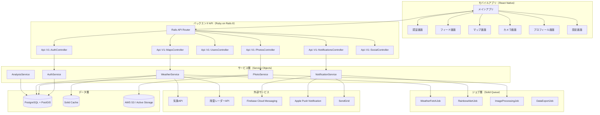
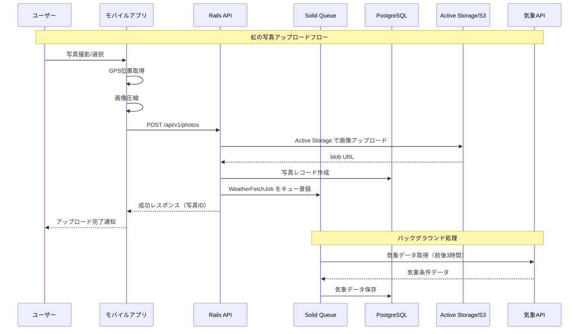

# 設計書

## 概要

塩尻レインボーシーカー（ShiojiriRainbowSeeker）は、虹の写真共有、虹出現通知、および虹出現地域分析の3つの主要機能を提供するモバイルアプリケーションです。本設計書では、クロスプラットフォームモバイルアプリ（React Native）とバックエンドAPI（Ruby on Rails 8）、およびデータベース（PostgreSQL/PostGIS）を用いたシステムアーキテクチャを定義します。

### 設計の基本方針
- **モジュラー設計**: 各機能を独立したモジュールとして実装し、保守性と拡張性を確保
- **オフラインファースト**: ネットワーク接続がない状態でも基本的な操作を可能にする
- **スケーラブル**: 将来のユーザー数増加や機能拡張に対応できる設計
- **セキュアバイデザイン**: セキュリティを設計段階から組み込む

## ステアリングドキュメントとの整合性

### 技術標準（tech.md）
本プロジェクトは新規開発のため、以下の技術スタックを採用します：
- **フロントエンド**: React Native（iOS/Android対応）
- **バックエンド**: Ruby on Rails 8（API モード）
- **データベース**: PostgreSQL + PostGIS（地理空間データ対応）
- **認証**: Devise + JWT（JSON Web Token）
- **API設計**: RESTful API（Rails標準）
- **画像ストレージ**: Active Storage + AWS S3 + CloudFront CDN
- **バックグラウンドジョブ**: Solid Queue（Rails 8標準）
- **キャッシュ**: Solid Cache（Rails 8標準）

### プロジェクト構造（structure.md）
```
shiojiri-rainbow-seeker/
├── mobile/                          # React Nativeモバイルアプリ
│   ├── src/
│   │   ├── components/              # 再利用可能なUIコンポーネント
│   │   ├── screens/                 # 画面コンポーネント
│   │   ├── navigation/              # ナビゲーション設定
│   │   ├── services/                # APIクライアント、外部サービス連携
│   │   ├── hooks/                   # カスタムフック
│   │   ├── store/                   # 状態管理（Redux/Zustand）
│   │   ├── utils/                   # ユーティリティ関数
│   │   ├── types/                   # TypeScript型定義
│   │   ├── i18n/                    # 国際化（日本語/英語）
│   │   └── assets/                  # 画像、フォント等
│   └── __tests__/                   # テストファイル
├── backend/                         # Ruby on Rails 8 API
│   ├── app/
│   │   ├── controllers/
│   │   │   └── api/
│   │   │       └── v1/              # APIバージョニング
│   │   │           ├── auth_controller.rb
│   │   │           ├── photos_controller.rb
│   │   │           ├── users_controller.rb
│   │   │           ├── notifications_controller.rb
│   │   │           ├── maps_controller.rb
│   │   │           └── admin/       # 管理者用コントローラ
│   │   ├── models/                  # Active Recordモデル
│   │   │   ├── user.rb
│   │   │   ├── photo.rb
│   │   │   ├── weather_condition.rb
│   │   │   ├── radar_data.rb
│   │   │   ├── comment.rb
│   │   │   ├── like.rb
│   │   │   ├── notification.rb
│   │   │   └── report.rb
│   │   ├── services/                # ビジネスロジック（Service Objects）
│   │   │   ├── auth_service.rb
│   │   │   ├── photo_service.rb
│   │   │   ├── weather_service.rb
│   │   │   ├── notification_service.rb
│   │   │   └── analysis_service.rb
│   │   ├── jobs/                    # Solid Queueジョブ
│   │   │   ├── weather_fetch_job.rb
│   │   │   ├── rainbow_alert_job.rb
│   │   │   ├── image_processing_job.rb
│   │   │   └── data_export_job.rb
│   │   ├── serializers/             # JSONシリアライザ（Alba/Blueprinter）
│   │   ├── validators/              # カスタムバリデータ
│   │   └── mailers/                 # メール送信
│   ├── config/
│   │   ├── routes.rb                # ルーティング
│   │   └── initializers/            # 初期設定
│   ├── db/
│   │   ├── migrate/                 # マイグレーション
│   │   └── seeds.rb                 # シードデータ
│   ├── lib/
│   │   └── external_apis/           # 外部API連携モジュール
│   │       ├── weather_api.rb
│   │       ├── radar_api.rb
│   │       └── geocoding_api.rb
│   └── spec/                        # RSpecテスト
│       ├── models/
│       ├── requests/
│       ├── services/
│       └── jobs/
└── shared/                          # 共有定数・設定
```

## コード再利用分析

### 新規プロジェクトのため活用する外部ライブラリ

#### モバイルアプリ（React Native）
- **react-native-maps**: マップ表示、マーカー、クラスタリング
- **react-native-camera / expo-camera**: カメラ機能
- **react-native-image-picker**: 画像選択
- **@react-native-community/geolocation**: GPS位置取得
- **react-native-push-notification / expo-notifications**: プッシュ通知
- **@react-navigation/native**: 画面遷移
- **react-native-chart-kit**: グラフ表示（気象データ可視化）
- **i18next / react-i18next**: 多言語対応
- **zustand / redux-toolkit**: 状態管理
- **react-query / tanstack-query**: サーバー状態管理
- **async-storage**: ローカルストレージ

#### バックエンド（Ruby on Rails 8）
- **devise**: 認証基盤
- **devise-jwt**: JWT認証
- **bcrypt**: パスワードハッシュ
- **active_storage**: ファイルアップロード（Rails標準）
- **aws-sdk-s3**: S3連携
- **image_processing / vips**: 画像圧縮・リサイズ
- **solid_queue**: バックグラウンドジョブ（Rails 8標準）
- **solid_cache**: キャッシュ（Rails 8標準）
- **activerecord-postgis-adapter**: PostGIS対応
- **rgeo / rgeo-geojson**: 地理空間データ処理
- **alba / blueprinter**: JSONシリアライザ
- **rack-cors**: CORS設定
- **pundit**: 認可
- **kaminari**: ページネーション
- **fcm / rpush**: プッシュ通知
- **suncalc-ruby**: 太陽位置計算
- **httparty / faraday**: HTTP クライアント
- **rails-i18n**: 国際化

### 統合ポイント

| 外部サービス | 用途 | 統合方法 |
|-------------|------|----------|
| OpenWeatherMap API | 気象データ取得 | Faraday HTTP クライアント |
| 気象庁API / RainViewer | 雨雲レーダーデータ | Faraday HTTP クライアント |
| AWS S3 | 画像ストレージ | Active Storage + aws-sdk-s3 |
| CloudFront CDN | 画像配信 | S3連携 |
| Firebase Cloud Messaging | Androidプッシュ通知 | fcm gem |
| Apple Push Notification | iOSプッシュ通知 | rpush gem |
| SendGrid | メール送信 | Action Mailer + sendgrid-ruby |
| Google Maps / Mapbox | 地図表示・ジオコーディング | React Native SDK + geocoder gem |

## アーキテクチャ

### システム全体アーキテクチャ



### Rails 8 の新機能活用

- **Solid Queue**: デフォルトのジョブバックエンド。Redis不要で、PostgreSQLで動作
- **Solid Cache**: デフォルトのキャッシュストア。Redis不要で、PostgreSQLで動作
- **Kamal 2**: デプロイメント自動化（Docker + SSH）
- **Propshaft**: アセットパイプライン（API モードでは軽量）
- **Thruster**: 本番環境での高速HTTPサーバー

### モジュラー設計原則

- **単一ファイル責任**: 各ファイルは1つの明確な責務のみを持つ
- **Service Objects**: ビジネスロジックをコントローラから分離
- **コンポーネント分離**: 小さく焦点を絞ったコンポーネントを作成
- **Concerns**: 共通ロジックをモジュールとして抽出
- **ユーティリティモジュール化**: 汎用機能は単一目的のモジュールに分割

### データフロー



## コンポーネントとインターフェース

### モバイルアプリ コンポーネント

#### 画面コンポーネント

##### AuthScreen（認証画面）
- **目的**: ユーザーのログイン・登録・パスワードリセット
- **インターフェース**:
  - `login(email, password): Promise<User>`
  - `register(email, password, displayName): Promise<User>`
  - `resetPassword(email): Promise<void>`
- **依存**: AuthService, ValidationUtils
- **要件参照**: FR-1

##### FeedScreen（フィード画面）
- **目的**: 虹の写真フィードの表示、フィルタリング、検索
- **インターフェース**:
  - `fetchPhotos(page, filters): Promise<Photo[]>`
  - `filterByLocation(lat, lng, radius): void`
  - `filterByDateRange(start, end): void`
  - `searchByKeyword(keyword): void`
- **依存**: PhotoService, LocationService
- **要件参照**: FR-4

##### MapScreen（マップ画面）
- **目的**: 地図上に虹の目撃情報を表示、ヒートマップ
- **インターフェース**:
  - `loadMarkers(bounds): Promise<Marker[]>`
  - `showHeatmap(): void`
  - `showRegionStats(regionId): Promise<RegionStats>`
- **依存**: MapService, AnalysisService
- **要件参照**: FR-5, FR-13

##### CameraScreen（カメラ画面）
- **目的**: 虹の写真撮影、ギャラリー選択、位置タグ付け
- **インターフェース**:
  - `capturePhoto(): Promise<PhotoData>`
  - `selectFromGallery(): Promise<PhotoData>`
  - `setLocation(lat, lng): void`
  - `uploadPhoto(photoData, metadata): Promise<Photo>`
- **依存**: CameraService, LocationService, PhotoService
- **要件参照**: FR-2, FR-3

##### PhotoDetailScreen（写真詳細画面）
- **目的**: 写真の詳細表示、気象条件データ、コメント
- **インターフェース**:
  - `getPhotoDetail(photoId): Promise<PhotoDetail>`
  - `getWeatherData(photoId): Promise<WeatherData>`
  - `likePhoto(photoId): Promise<void>`
  - `addComment(photoId, content): Promise<Comment>`
- **依存**: PhotoService, WeatherService, SocialService
- **要件参照**: FR-3, FR-8, FR-13

##### ProfileScreen（プロフィール画面）
- **目的**: ユーザープロフィール管理、自分の写真一覧
- **インターフェース**:
  - `getUserProfile(): Promise<UserProfile>`
  - `updateProfile(data): Promise<UserProfile>`
  - `getMyPhotos(page): Promise<Photo[]>`
  - `deletePhoto(photoId): Promise<void>`
- **依存**: UserService, PhotoService
- **要件参照**: FR-9

##### SettingsScreen（設定画面）
- **目的**: 通知設定、プライバシー設定、アカウント管理
- **インターフェース**:
  - `getSettings(): Promise<Settings>`
  - `updateNotificationSettings(settings): Promise<void>`
  - `exportData(): Promise<string>`
  - `deleteAccount(): Promise<void>`
- **依存**: SettingsService, NotificationService
- **要件参照**: FR-7, FR-12

#### 共通UIコンポーネント

| コンポーネント | 目的 | Props |
|---------------|------|-------|
| PhotoCard | 写真カードの表示 | photo, onPress, onLike |
| PhotoGrid | 写真のグリッド表示 | photos, columns, onPhotoPress |
| MapMarker | マップマーカー | location, count, onPress |
| ClusteredMap | クラスタリング地図 | markers, onMarkerPress |
| WeatherChart | 気象データグラフ | weatherData, timeRange |
| RadarAnimation | 雨雲レーダーアニメーション | radarData, timestamps |
| CommentList | コメント一覧 | comments, onReply |
| LocationPicker | 位置選択マップ | initialLocation, onSelect |
| LoadingSpinner | ローディング表示 | size, color |
| ErrorBoundary | エラー境界 | fallback, onError |

### バックエンドAPI コンポーネント（Ruby on Rails 8）

#### コントローラー

##### Api::V1::AuthController
- **目的**: 認証エンドポイント処理
- **エンドポイント**:
  - `POST /api/v1/auth/register` - ユーザー登録
  - `POST /api/v1/auth/login` - ログイン
  - `DELETE /api/v1/auth/logout` - ログアウト
  - `POST /api/v1/auth/refresh` - トークンリフレッシュ
  - `POST /api/v1/auth/password/reset` - パスワードリセット要求
  - `PUT /api/v1/auth/password/reset` - パスワードリセット確認
  - `GET /api/v1/auth/verify_email/:token` - メール認証
- **要件参照**: FR-1

##### Api::V1::PhotosController
- **目的**: 写真関連エンドポイント処理
- **エンドポイント**:
  - `GET /api/v1/photos` - 写真一覧取得（ページネーション、フィルタ対応）
  - `GET /api/v1/photos/:id` - 写真詳細取得
  - `POST /api/v1/photos` - 写真アップロード
  - `PATCH /api/v1/photos/:id` - 写真情報更新
  - `DELETE /api/v1/photos/:id` - 写真削除
  - `GET /api/v1/photos/:id/weather` - 気象条件データ取得
- **要件参照**: FR-2, FR-3, FR-4, FR-13

##### Api::V1::MapsController
- **目的**: 地図関連エンドポイント処理
- **エンドポイント**:
  - `GET /api/v1/maps/markers` - 範囲内のマーカー取得
  - `GET /api/v1/maps/clusters` - クラスタリングされたマーカー取得
  - `GET /api/v1/maps/heatmap` - ヒートマップデータ取得
  - `GET /api/v1/maps/regions/:id/stats` - 地域統計取得
- **要件参照**: FR-5, FR-13

##### Api::V1::SocialController
- **目的**: ソーシャル機能エンドポイント処理
- **エンドポイント**:
  - `POST /api/v1/photos/:photo_id/likes` - いいね
  - `DELETE /api/v1/photos/:photo_id/likes` - いいね解除
  - `GET /api/v1/photos/:photo_id/comments` - コメント一覧
  - `POST /api/v1/photos/:photo_id/comments` - コメント投稿
  - `POST /api/v1/photos/:photo_id/reports` - 不適切コンテンツ報告
- **要件参照**: FR-8

##### Api::V1::NotificationsController
- **目的**: 通知関連エンドポイント処理
- **エンドポイント**:
  - `GET /api/v1/notifications` - 通知一覧
  - `PATCH /api/v1/notifications/:id/read` - 既読マーク
  - `GET /api/v1/notifications/settings` - 通知設定取得
  - `PATCH /api/v1/notifications/settings` - 通知設定更新
- **要件参照**: FR-6, FR-7

##### Api::V1::UsersController
- **目的**: ユーザー関連エンドポイント処理
- **エンドポイント**:
  - `GET /api/v1/users/me` - 自分のプロフィール取得
  - `PATCH /api/v1/users/me` - プロフィール更新
  - `GET /api/v1/users/me/photos` - 自分の写真一覧
  - `POST /api/v1/users/me/export` - データエクスポート要求
  - `DELETE /api/v1/users/me` - アカウント削除
- **要件参照**: FR-9, FR-12

##### Api::V1::Admin::ReportsController
- **目的**: 管理者機能エンドポイント処理
- **エンドポイント**:
  - `GET /api/v1/admin/reports` - 報告一覧
  - `PATCH /api/v1/admin/reports/:id` - 報告処理（承認/非表示/削除）
  - `GET /api/v1/admin/users` - ユーザー一覧
  - `PATCH /api/v1/admin/users/:id/status` - ユーザーステータス変更
- **要件参照**: FR-10

#### サービス層（Service Objects）

##### AuthService
```ruby
class AuthService
  def register(email:, password:, display_name:)
    # ユーザー作成、メール認証送信
  end

  def login(email:, password:)
    # 認証、JWTトークン発行
  end

  def verify_email(token:)
    # メール認証処理
  end

  def refresh_token(refresh_token:)
    # トークンリフレッシュ
  end

  def reset_password(email:)
    # パスワードリセット要求
  end

  def confirm_password_reset(token:, new_password:)
    # パスワードリセット確認
  end
end
```

##### PhotoService
```ruby
class PhotoService
  def create(user:, image:, metadata:)
    # 写真作成、Active Storage アップロード、WeatherFetchJob キュー登録
  end

  def find_with_details(photo_id:)
    # 写真詳細取得（気象データ含む）
  end

  def list(filters:, page:, per_page:)
    # フィルタ・ページネーション対応一覧
  end

  def update(photo:, params:)
    # 写真情報更新
  end

  def destroy(photo:)
    # 写真削除（Active Storage も削除）
  end

  def weather_data(photo_id:)
    # 気象条件データ取得
  end
end
```

##### WeatherService
```ruby
class WeatherService
  def fetch_current_conditions(lat:, lng:)
    # 現在の気象条件取得
  end

  def fetch_historical_data(lat:, lng:, start_time:, end_time:)
    # 履歴気象データ取得（前後3時間）
  end

  def fetch_radar_data(lat:, lng:, timestamps:)
    # 雨雲レーダーデータ取得
  end

  def calculate_sun_position(lat:, lng:, time:)
    # 太陽位置計算（suncalc-ruby使用）
  end

  def check_rainbow_conditions(lat:, lng:)
    # 虹条件チェック
  end
end
```

##### NotificationService
```ruby
class NotificationService
  def send_push_notification(user:, payload:)
    # プッシュ通知送信（FCM/APNs）
  end

  def send_rainbow_alert(user_ids:, condition:)
    # 虹アラート一斉送信
  end

  def schedule_notification(notification:, scheduled_at:)
    # 通知スケジュール
  end

  def list_for_user(user:, page:, per_page:)
    # ユーザーの通知一覧
  end
end
```

##### AnalysisService
```ruby
class AnalysisService
  def region_stats(region_id:)
    # 地域統計取得
  end

  def heatmap_data(bounds:)
    # ヒートマップデータ生成
  end

  def rainbow_trends(region_id:)
    # 虹出現傾向分析
  end

  def export_dataset(filters:)
    # データセットエクスポート（機械学習用）
  end
end
```

## データモデル

### User（ユーザー）
```ruby
# app/models/user.rb
class User < ApplicationRecord
  # Devise モジュール
  devise :database_authenticatable, :registerable, :recoverable,
         :rememberable, :validatable, :confirmable, :jwt_authenticatable,
         jwt_revocation_strategy: JwtDenylist

  # Active Storage
  has_one_attached :profile_image

  # アソシエーション
  has_many :photos, dependent: :destroy
  has_many :comments, dependent: :destroy
  has_many :likes, dependent: :destroy
  has_many :notifications, dependent: :destroy
  has_many :device_tokens, dependent: :destroy

  # バリデーション
  validates :display_name, presence: true, length: { in: 3..30 }
  validates :locale, inclusion: { in: %w[ja en] }

  # Enum
  enum :role, { user: 0, admin: 1 }

  # 属性
  # id: uuid
  # email: string (unique)
  # encrypted_password: string
  # display_name: string
  # role: integer (default: 0)
  # notification_settings: jsonb (default: {})
  # locale: string (default: 'ja')
  # created_at, updated_at, deleted_at (論理削除)
end
```

### Photo（写真）
```ruby
# app/models/photo.rb
class Photo < ApplicationRecord
  # Active Storage
  has_one_attached :image
  has_one_attached :thumbnail

  # アソシエーション
  belongs_to :user
  has_many :weather_conditions, dependent: :destroy
  has_many :radar_data, dependent: :destroy
  has_many :comments, dependent: :destroy
  has_many :likes, dependent: :destroy
  has_many :reports, as: :reportable, dependent: :destroy

  # PostGIS 地理空間クエリ用
  # rgeo-activerecord を使用

  # バリデーション
  validates :title, length: { maximum: 100 }, allow_nil: true
  validates :description, length: { maximum: 500 }, allow_nil: true
  validates :captured_at, presence: true

  # Enum
  enum :moderation_status, { pending: 0, approved: 1, hidden: 2, deleted: 3 }

  # スコープ
  scope :visible, -> { where(is_visible: true, moderation_status: :approved) }
  scope :recent, -> { order(captured_at: :desc) }
  scope :within_bounds, ->(sw_lat, sw_lng, ne_lat, ne_lng) {
    where("ST_Within(location, ST_MakeEnvelope(?, ?, ?, ?, 4326))", sw_lng, sw_lat, ne_lng, ne_lat)
  }

  # 属性
  # id: uuid
  # user_id: uuid (FK)
  # title: string
  # description: text
  # location: geography(point, 4326)  # PostGIS
  # altitude: decimal
  # accuracy: decimal
  # location_name: string
  # captured_at: datetime
  # like_count: integer (default: 0)
  # comment_count: integer (default: 0)
  # is_visible: boolean (default: true)
  # moderation_status: integer (default: 1)
  # created_at, updated_at
end
```

### WeatherCondition（気象条件）
```ruby
# app/models/weather_condition.rb
class WeatherCondition < ApplicationRecord
  belongs_to :photo
  belongs_to :radar_datum, optional: true

  # 属性
  # id: uuid
  # photo_id: uuid (FK)
  # timestamp: datetime
  # temperature: decimal (気温 ℃)
  # humidity: decimal (湿度 %)
  # pressure: decimal (気圧 hPa)
  # weather_code: string
  # weather_description: string
  # wind_speed: decimal (風速 m/s)
  # wind_direction: decimal (風向 度)
  # wind_gust: decimal (突風 m/s)
  # precipitation: decimal (降水量 mm)
  # precipitation_type: string (rain/snow/none)
  # cloud_cover: decimal (雲量 %)
  # visibility: decimal (視程 km)
  # sun_azimuth: decimal (太陽方位角 度)
  # sun_altitude: decimal (太陽高度 度)
  # radar_datum_id: uuid (FK)
  # created_at
end
```

### RadarDatum（雨雲レーダーデータ）
```ruby
# app/models/radar_datum.rb
class RadarDatum < ApplicationRecord
  # Active Storage
  has_one_attached :radar_image

  # アソシエーション
  belongs_to :photo
  has_many :weather_conditions

  # 属性
  # id: uuid
  # photo_id: uuid (FK)
  # timestamp: datetime
  # center_location: geography(point, 4326)
  # radius: decimal (範囲半径 km)
  # precipitation_intensity: decimal
  # precipitation_area: jsonb (GeoJSON)
  # movement_direction: decimal (移動方向 度)
  # movement_speed: decimal (移動速度 km/h)
  # created_at
end
```

### Comment（コメント）
```ruby
# app/models/comment.rb
class Comment < ApplicationRecord
  belongs_to :user
  belongs_to :photo, counter_cache: true
  has_many :reports, as: :reportable, dependent: :destroy

  validates :content, presence: true, length: { maximum: 500 }

  scope :visible, -> { where(is_visible: true) }
end
```

### Like（いいね）
```ruby
# app/models/like.rb
class Like < ApplicationRecord
  belongs_to :user
  belongs_to :photo, counter_cache: true

  validates :user_id, uniqueness: { scope: :photo_id }
end
```

### Notification（通知）
```ruby
# app/models/notification.rb
class Notification < ApplicationRecord
  belongs_to :user

  enum :notification_type, { rainbow_alert: 0, like: 1, comment: 2, system: 3 }

  scope :unread, -> { where(is_read: false) }
  scope :recent, -> { order(created_at: :desc) }
end
```

### Report（報告）
```ruby
# app/models/report.rb
class Report < ApplicationRecord
  belongs_to :reporter, class_name: 'User'
  belongs_to :reportable, polymorphic: true
  belongs_to :resolved_by, class_name: 'User', optional: true

  enum :status, { pending: 0, resolved: 1, dismissed: 2 }
end
```

### データベーススキーマ（PostgreSQL + PostGIS）

```ruby
# db/migrate/xxxxx_create_tables.rb

# PostGIS拡張の有効化
enable_extension 'postgis'
enable_extension 'pgcrypto'  # UUIDサポート

create_table :users, id: :uuid do |t|
  t.string :email, null: false
  t.string :encrypted_password, null: false
  t.string :display_name, null: false, limit: 30
  t.integer :role, default: 0
  t.jsonb :notification_settings, default: {}
  t.string :locale, default: 'ja', limit: 5

  # Devise
  t.string :reset_password_token
  t.datetime :reset_password_sent_at
  t.datetime :remember_created_at
  t.string :confirmation_token
  t.datetime :confirmed_at
  t.datetime :confirmation_sent_at
  t.string :unconfirmed_email

  t.timestamps
  t.datetime :deleted_at

  t.index :email, unique: true
  t.index :reset_password_token, unique: true
  t.index :confirmation_token, unique: true
end

create_table :photos, id: :uuid do |t|
  t.references :user, type: :uuid, foreign_key: true, null: false
  t.string :title, limit: 100
  t.text :description
  t.st_point :location, geographic: true, srid: 4326, null: false
  t.decimal :altitude
  t.decimal :accuracy
  t.string :location_name
  t.datetime :captured_at, null: false
  t.integer :like_count, default: 0
  t.integer :comment_count, default: 0
  t.boolean :is_visible, default: true
  t.integer :moderation_status, default: 1

  t.timestamps

  t.index :location, using: :gist
  t.index :captured_at
  t.index :user_id
end

create_table :weather_conditions, id: :uuid do |t|
  t.references :photo, type: :uuid, foreign_key: true, null: false
  t.datetime :timestamp, null: false
  t.decimal :temperature
  t.decimal :humidity
  t.decimal :pressure
  t.string :weather_code, limit: 20
  t.string :weather_description
  t.decimal :wind_speed
  t.decimal :wind_direction
  t.decimal :wind_gust
  t.decimal :precipitation
  t.string :precipitation_type, limit: 20
  t.decimal :cloud_cover
  t.decimal :visibility
  t.decimal :sun_azimuth
  t.decimal :sun_altitude
  t.references :radar_datum, type: :uuid, foreign_key: true

  t.datetime :created_at

  t.index [:photo_id, :timestamp]
end

# radar_data, comments, likes, notifications, reports は同様に定義
```

## エラーハンドリング

### Rails での統一エラーハンドリング

```ruby
# app/controllers/application_controller.rb
class ApplicationController < ActionController::API
  rescue_from ActiveRecord::RecordNotFound, with: :not_found
  rescue_from ActiveRecord::RecordInvalid, with: :unprocessable_entity
  rescue_from ActionController::ParameterMissing, with: :bad_request
  rescue_from Pundit::NotAuthorizedError, with: :forbidden

  private

  def not_found(exception)
    render json: { error: { code: 3001, message: exception.message } }, status: :not_found
  end

  def unprocessable_entity(exception)
    render json: { error: { code: 2001, message: exception.message, details: exception.record&.errors } }, status: :unprocessable_entity
  end

  def bad_request(exception)
    render json: { error: { code: 2002, message: exception.message } }, status: :bad_request
  end

  def forbidden(exception)
    render json: { error: { code: 1003, message: 'アクセス権限がありません' } }, status: :forbidden
  end
end
```

### エラーコード体系

| コード範囲 | カテゴリ | 例 |
|-----------|---------|-----|
| 1000-1999 | 認証エラー | 1001: 無効なメール, 1002: パスワード不正, 1003: 権限不足 |
| 2000-2999 | バリデーションエラー | 2001: 必須フィールド不足, 2002: 文字数超過 |
| 3000-3999 | リソースエラー | 3001: 写真が見つからない, 3002: ユーザーが見つからない |
| 4000-4999 | 外部サービスエラー | 4001: 気象API障害, 4002: S3アップロード失敗 |
| 5000-5999 | サーバーエラー | 5001: データベースエラー, 5002: 内部エラー |

### エラーシナリオ

#### 1. ネットワークエラー
- **説明**: API通信失敗、タイムアウト
- **ハンドリング**: モバイルアプリで自動リトライ（exponential backoff）
- **ユーザー影響**: 「接続エラー。再試行中...」トースト表示

#### 2. 認証エラー
- **説明**: トークン期限切れ、無効な認証情報
- **ハンドリング**: Devise JWT でリフレッシュトークン自動更新
- **ユーザー影響**: 「セッションが切れました。再度ログインしてください」

#### 3. 画像アップロードエラー
- **説明**: ファイルサイズ超過、サーバーエラー
- **ハンドリング**: Active Storage のバリデーション、ImageProcessingJob でリトライ
- **ユーザー影響**: 「アップロードに失敗しました。後で自動的に再試行します」

#### 4. 気象API エラー
- **説明**: 外部APIの障害、レート制限
- **ハンドリング**: Solid Cache でキャッシュ使用、Solid Queue でリトライ
- **ユーザー影響**: 「一部の気象データを取得できませんでした」

## テスト戦略

### ユニットテスト（RSpec）
- **対象**: モデル、サービス、バリデータ
- **フレームワーク**: RSpec + FactoryBot + Faker
- **カバレッジ目標**: 80%以上（SimpleCov）
- **重点テスト項目**:
  - User モデル: Devise 認証、バリデーション
  - Photo モデル: PostGIS クエリ、スコープ
  - WeatherService: 気象データ解析、虹条件判定
  - PhotoService: 画像処理、メタデータ抽出

### リクエストスペック（統合テスト）
- **対象**: API エンドポイント
- **フレームワーク**: RSpec + rack-test
- **重点テストフロー**:
  - ユーザー登録 → メール認証 → ログイン
  - 写真アップロード → 気象データ取得 → 保存
  - いいね・コメント操作
  - 通知設定変更

### ジョブテスト
- **対象**: Solid Queue ジョブ
- **フレームワーク**: RSpec + ActiveJob::TestHelper
- **重点テスト項目**:
  - WeatherFetchJob: 外部API呼び出し、エラーハンドリング
  - RainbowAlertJob: プッシュ通知送信
  - ImageProcessingJob: サムネイル生成

### E2Eテスト（モバイルアプリ）
- **対象**: 主要ユーザーフロー
- **フレームワーク**: Detox（React Native）
- **テストシナリオ**:
  1. 新規ユーザー登録からオンボーディング完了
  2. 虹の写真撮影・アップロード・公開
  3. フィード閲覧・フィルタリング・検索
  4. マップビュー・ヒートマップ表示
  5. 他ユーザーの写真へのいいね・コメント
  6. プロフィール編集・写真削除
  7. 通知設定変更

### パフォーマンステスト
- **ツール**: k6, Apache Bench
- **テスト項目**:
  - API応答時間（目標: p95 < 200ms）
  - 画像アップロード時間（目標: < 10秒@10Mbps）
  - 同時接続数（目標: 1000同時ユーザー）
  - データベースクエリ性能（bullet gem でN+1検出）

### セキュリティテスト
- **ツール**: Brakeman, bundler-audit
- **テスト項目**:
  - SQLインジェクション
  - XSS（クロスサイトスクリプティング）
  - 認証・認可の不備
  - 機密データの露出
  - レート制限の動作確認（rack-attack）
